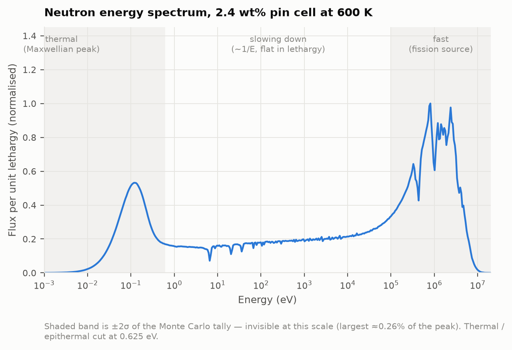
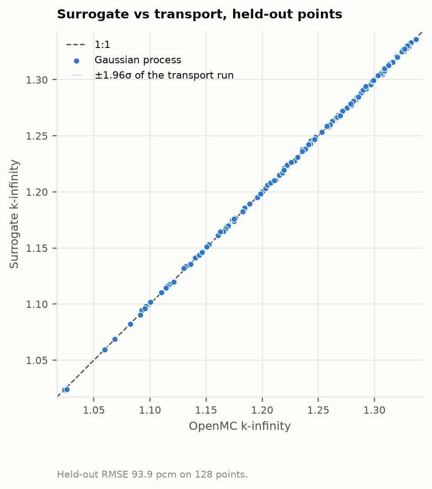
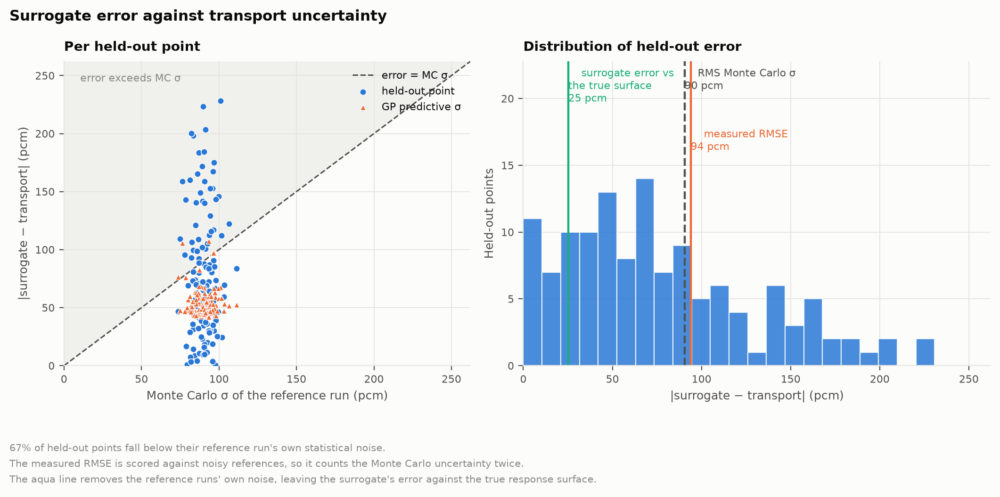
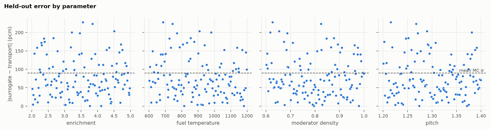
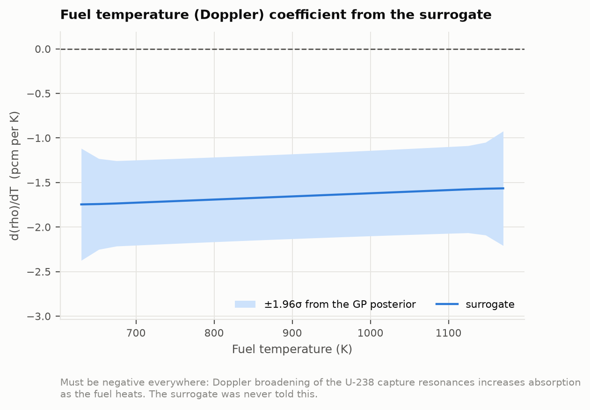
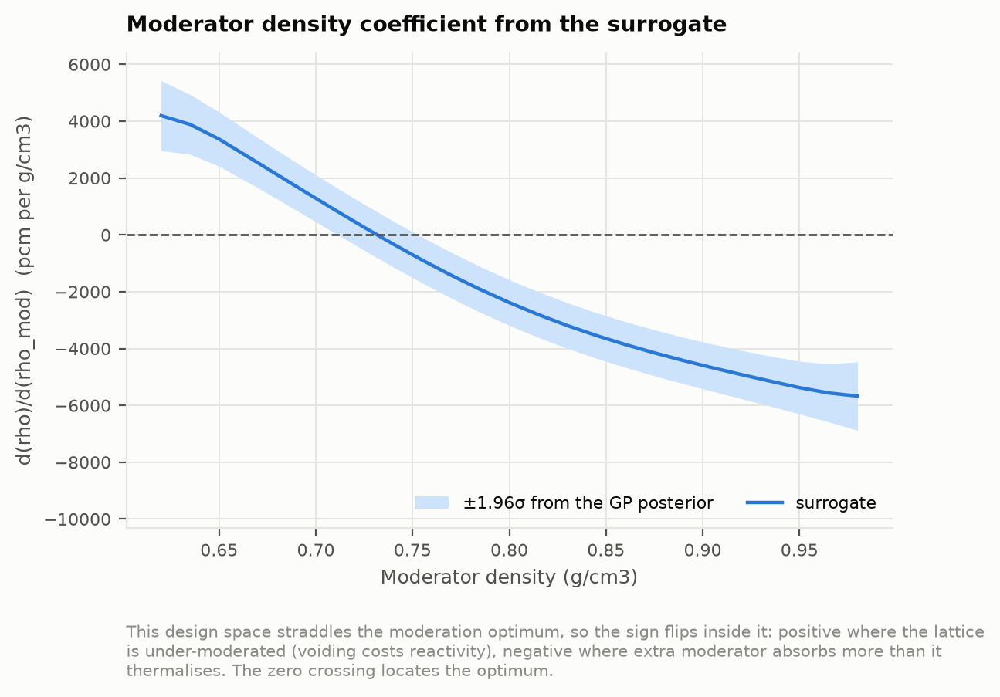
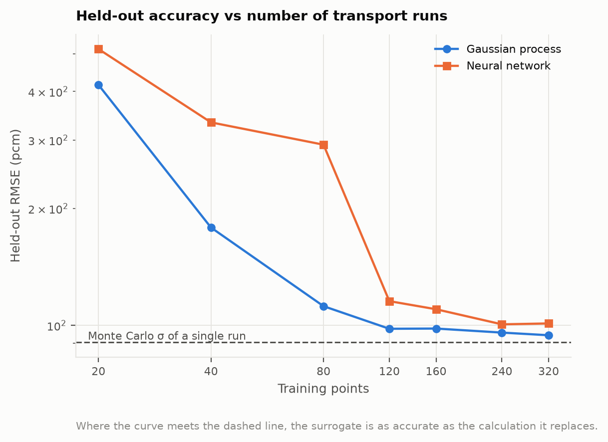

# Surrogate Modeling of Lattice Reactivity with Uncertainty Quantification

A Monte Carlo neutron transport campaign in [OpenMC](https://openmc.org) over a
PWR pin-cell lattice, a surrogate model trained to predict k-infinity across the
fuel enrichment / fuel temperature / moderator density / pitch parameter space,
and a test of whether the surrogate's prediction error falls below the
**stochastic uncertainty of the transport calculation it replaces**.

That last clause is the point of the project. A regressor that fits k-infinity
to three decimal places is unremarkable. The question worth asking is how its
error compares to the noise floor of the physics calculation underneath it —
because below that floor, "more accurate" stops meaning anything.

---

## 1. Problem and motivation

Monte Carlo transport gives you an eigenvalue *and a distribution*. Every
k-infinity in this repository is reported as `k ± σ`, and σ is not decoration:
it sets the resolution of every downstream claim.

Design work — optimisation, sensitivity studies, uncertainty propagation, fuel
management — needs thousands to millions of evaluations of k over a parameter
space. Full transport at each point is unaffordable. A surrogate is the standard
answer, and the standard way to report one is a held-out R² near 1, which tells
you almost nothing about whether the surrogate is usable in place of the
physics.

The useful question is comparative:

> Is the surrogate's held-out error smaller than the statistical uncertainty of
> the Monte Carlo runs that trained it?

If yes, the surrogate is as accurate as the calculation it replaces, and the
residual is dominated by Monte Carlo noise in the labels rather than by the
model. If no, the model is the limitation and you can say where and why. Both
answers are informative; this repository is built so that either one can come
out.

---

## 2. Model setup

A standard PWR fuel pin cell: UO₂ fuel, helium gap, Zircaloy-4 cladding,
borated light water moderator, square pitch, **reflective boundaries on all six
faces** — so the eigenvalue is k-infinity for an infinite lattice of identical
pins, with no leakage.

Geometry and nominal composition follow the pin cell distributed with OpenMC's
own examples, which is derived from the BEAVRS benchmark specification.

| held fixed | value |
|---|---|
| fuel pellet radius | 0.39218 cm |
| clad inner / outer radius | 0.40005 / 0.45720 cm |
| fuel density | 10.29769 g/cm³ (~94 % theoretical) |
| soluble boron | 975 ppm by weight of the solution |
| clad and moderator temperature | 600 K |

| swept | range | why it matters |
|---|---|---|
| fuel enrichment | 2–5 wt% ²³⁵U | primary reactivity control; 5 wt% is the LEU licensing limit |
| fuel temperature | 600–1200 K | Doppler broadening of ²³⁸U capture resonances |
| moderator density | 0.60–1.00 g/cm³ | voiding / boiling feedback |
| pitch | 1.20–1.40 cm | moderator-to-fuel ratio: over- vs under-moderation |

Three modelling details that are easy to get silently wrong, and are therefore
pinned down by tests in [tests/test_model.py](tests/test_model.py):

- **S(α,β) thermal scattering for hydrogen in water** (`c_H_in_H2O`). Leaving it
  out falls back to free-gas scattering in the thermal range and moves
  k-infinity by thousands of pcm. The run still completes normally.
- **Temperature interpolation.** Cross sections are tabulated only at discrete
  temperatures (250 / 294 / 600 / 900 / 1200 / 2500 K). Without
  `temperature = {"method": "interpolation"}` a swept fuel temperature snaps to
  the nearest library point, and the Doppler coefficient — the whole reason
  temperature is in the design space — comes out as a staircase.
- **Boron scaling.** Soluble boron is specified in ppm *by weight of the
  solution*, so the material is built from weight fractions and the boron number
  density scales with water density automatically. Specifying a fixed boron atom
  density instead would silently change the boron worth as the coolant voids.

The fuel temperature range is chosen to sit inside the library's tabulated
temperatures so the interpolation never extrapolates.

---

## 3. Sampling design and campaign

Three designs, each with a distinct job — see
[src/lattice_uq/sampling.py](src/lattice_uq/sampling.py):

- **train** — a Latin hypercube over the 4-D box, centred-discrepancy
  optimised. LHS rather than a grid because a factorial grid fine enough to
  resolve curvature in each direction costs far more runs for the same
  coverage, and every LHS point informs every dimension.
- **test** — an **independent scrambled Sobol sequence**. Holding out a random
  subset of the LHS would leave the held-out points stratified by the same
  design that produced the training set, which flatters the reported error. A
  separately generated sequence does not. (Collisions between the two designs
  are detected and dropped, since a "held-out" point the model trained on would
  quietly invalidate the headline number.) The size is a power of two, which is
  where Sobol's balance properties hold. The sequence is also extensible — the
  first *m* points of a length-*n* design are exactly the length-*m* design — so
  together with the content-addressed store, a held-out set can be grown later
  and only the genuinely new points get run.
- **replicate** — a handful of design points repeated under different RNG seeds.
  These are what make the central claim falsifiable: they measure the transport
  calculation's run-to-run scatter directly, so the σ everything is compared
  against is checked rather than trusted.

The campaign driver ([src/lattice_uq/campaign.py](src/lattice_uq/campaign.py))
is **resumable and parallel**. Resumption is by content-addressed presence in
the store, not a checkpoint file, so the driver can be killed at any instant and
restarted safely; results are written atomically as each run finishes. Failures
are logged per-run and never abort the campaign.

**How to parallelise it is not obvious, so it is measured.** Each design point
is an independent eigenvalue calculation, which suggests running many
single-threaded OpenMC processes. That turns out to be the wrong answer.
Monte Carlo transport is memory-bandwidth bound — the work is mostly random
access into cross-section tables far larger than cache — and every *process*
holds its own copy of those tables, while OpenMP *threads* inside a process
share one. [`scripts/calibrate.py`](scripts/calibrate.py) measures the trade-off
on the actual machine, at an interpolated temperature so the cost is
representative of campaign points rather than of the reference case:

| configuration | cores | histories/s |
|---|---|---|
| 1 process × 1 thread | 1 | 12,777 |
| 1 process × 8 threads | 8 | 48,052 |
| 1 process × 32 threads | 32 | 61,710 |
| 4 processes × 8 threads | 32 | 92,495 |
| **8 processes × 4 threads** | **32** | **94,382** |
| 14 processes × 1 thread | 14 | 81,558 |
| 20 processes × 1 thread | 20 | 81,238 |

*(32 logical cores, 16 GB, Docker Desktop on Windows. These are machine
numbers, not universal ones — regenerate them with `scripts/calibrate.py`
before a long campaign on different hardware.)*

Nothing reaches linear scaling: 32 cores buy 7.4× over one. The machine
saturates around 94k histories/s, and 20 single-threaded processes are no
better than 14 — past that point extra cores are waiting on memory, not
computing. The default is therefore a hybrid of several processes with a few
threads each. Running the calibration first was worth it: the naive
all-processes choice would have made this campaign 1.5× longer.

---

## 4. Results

<!-- BEGIN RESULTS -->

### Phase 1 — verification

Cross sections: `endfb-vii.1-hdf5` · OpenMC 0.15.3

**Reference pin cell** (the geometry and composition distributed with OpenMC's own examples, derived from BEAVRS):

| quantity | value |
|---|---|
| enrichment | 2.40 wt% U-235 |
| fuel temperature | 600 K |
| moderator density | 0.7406 g/cm³ |
| pitch | 1.25984 cm |
| histories | 50,000 × 110 active batches |
| **k-infinity** | **1.14482 ± 36 pcm** |
| thermal flux fraction in fuel | 0.1762 |
| wall time | 75.5 s |

**Checks.** Each one is a way the model could be wrong that a single k value would not reveal.

| check | what it rules out | result |
|---|---|---|
| Shannon entropy plateaus before the first active batch | tallying on an unconverged fission source | yes (half-to-half drift 1.31e-04) |
| σ falls as 1/√N | a reported uncertainty that is not a Monte Carlo uncertainty | yes (log–log slope -0.523, expected -0.500) |
| k rises monotonically with enrichment, beyond the noise | a sign error or a broken material build | yes (smallest step 2424 pcm) |

**What this is not.** No published benchmark k-infinity is reproduced here. The geometry and composition are the BEAVRS-derived pin cell, but it is run hot (600 K) with 975 ppm boron, and there is no published value for *that* state to compare against — quoting one for a different state would be worse than quoting none. Verification therefore rests on the checks above, which are properties the answer must have rather than a number it must match. A formal comparison against the Mosteller Doppler-defect benchmark, whose pin-cell specifications come with published MCNP eigenvalues, is the obvious next step and is listed under limitations.

Figures: [geometry](results/verification/fig_geometry.png) · [spectrum](results/verification/fig_spectrum.png) · [entropy](results/verification/fig_entropy.png) · [σ convergence](results/verification/fig_sigma_conv.png) · [enrichment sweep](results/verification/fig_enrichment.png)



### Phase 2 — campaign

488 transport runs: 320 Latin-hypercube training points, 128 independent Sobol held-out points, plus replicates of a few points under different RNG seeds.
k-infinity spans 1.0238–1.3434 across the design space.

**Is the quoted uncertainty honest?** Repeating a design point under different seeds measures the run-to-run scatter directly. The ratio of observed scatter to reported σ is **0.97** (≈1 means yes) — yes. Everything below is measured against that σ, so this had to be checked first.

### Phase 3 — surrogate and the uncertainty result

| | Gaussian process | Neural network |
|---|---|---|
| held-out RMSE | **93.9 pcm** | 98.1 pcm |
| held-out MAE | 77.2 pcm | 79.9 pcm |
| max abs error | 228.1 pcm | 262.4 pcm |
| bias | +15.7 pcm | +17.0 pcm |
| R² | 0.99985 | 0.99984 |
| 95% interval coverage | 0.98 | — |

**The comparison that matters:**

| quantity | pcm |
|---|---|
| surrogate held-out RMSE | 93.9 |
| RMS Monte Carlo σ of the held-out runs | 90.5 |
| upper bound on the noise contribution (adds training-label noise in quadrature) | 128.2 |
| **surrogate error vs the true surface** (reference noise deconvolved) | **25.1** |
| ratio measured RMSE / σ | 1.04 |
| ratio deconvolved / σ | 0.28 |

**Reading this table.** The measured RMSE is scored against references that are themselves noisy, so it double-counts the Monte Carlo uncertainty — once in the surrogate's error and once in the value it is compared to. Those are independent, so they add in quadrature and can be separated: `E[(pred − ref)²] = E[(pred − truth)²] + σ_ref²`. The deconvolved figure is the surrogate's error against the true response surface, which is what anyone using it actually cares about.

Measured RMSE below the transport runs' own σ: **no**. Deconvolved error below it: yes. Measured RMSE below the noise upper bound: yes.





**Cost.** A transport run at campaign settings takes 71.6 s on 4 threads (286.5 core-seconds); one surrogate evaluation takes 6.6 µs on one thread — a factor of 1.09e+07. That is a *marginal* cost comparison: it excludes the campaign that trained the surrogate, which a real application amortises over however many evaluations it needs.

**Where it is weakest.** The largest held-out error is 228.1 pcm at (enrichment 3.55, fuel temperature 686, moderator density 0.627, pitch 1.22), against a Monte Carlo σ of 101.0 pcm there — 2.3σ, the sort of outlier a held-out set this size produces on its own. That single point is not part of a pattern, though. The correlation between absolute error and distance from the edge of the design space is +0.01 — essentially none, so the error is spread evenly rather than concentrated at the boundary. Combined with the learning curve flattening, that points at Monte Carlo noise in the labels as the limitation rather than any particular region being hard to fit.



### Reactivity coefficients — a physics check the model was never given

Reactivity is ρ = (k−1)/k; the coefficients below are derivatives of the *fitted surface*, with uncertainties propagated from the GP's joint posterior at the two stencil points.

| coefficient | value | expected sign | consistent |
|---|---|---|---|
| fuel temperature (Doppler) | -1.7 ± 0.2 pcm per K | negative | yes |
| enrichment | +5343.3 ± 62.2 pcm per wt% U235 | positive | yes |

The Doppler coefficient is negative across the whole 600–1200 K range: yes. That is the single most important sign in reactor physics — as the fuel heats, Doppler broadening of the U-238 capture resonances increases absorption during slowing down, and reactivity must fall. The surrogate was trained only on (parameters → k); it was never told this.



**The stronger check: where is the moderation optimum?** Pitch and moderator density are two different inputs, but they act on k-infinity through one physical quantity — the density-weighted moderator-to-fuel volume ratio. So the peak found by sweeping density at fixed pitch and the peak found by sweeping pitch at fixed density must land on the *same* ratio. Two directions through a 4-D fitted surface have no reason to agree unless the surrogate has learned the physics rather than a convenient interpolant.

| swept | peak at | implied Vm/Vf |
|---|---|---|
| moderator density | 0.7313 g/cm³ | 1.564 |
| pitch | 1.2657 cm | 1.565 |

They differ by 0.06% — yes.

This is also why no fixed sign is asserted for the moderator density or pitch coefficients: the sampled box **straddles the optimum**, so both coefficients genuinely change sign inside it — positive where the lattice is under-moderated, negative where added moderator absorbs more than it thermalises. An earlier version of this analysis asserted a positive sign and was wrong; the design space is wider than a nominal PWR lattice, and its centre sits on the over-moderated side.



**How many runs were actually needed?**



### Validation against transport the surrogate never saw

Signs are a consistency check; magnitudes are a validation. Each coefficient below is also computed directly from a pair of dedicated high-precision transport runs (50,000 particles each) at the ends of the parameter's range, which were never part of the training set. A wide interval is used deliberately — the reactivity difference is of order 1000 pcm while each run's σ is a few tens, so the difference is well determined.

| coefficient | direct transport | surrogate | agreement |
|---|---|---|---|
| fuel temperature (Doppler) (pcm per K) | -1.69 ± 0.06 | -1.66 ± 0.07 | 0.3σ apart ✓ |
| enrichment (pcm per wt% U235) | +6437.64 ± 12.32 | +6433.92 ± 20.31 | 0.2σ apart ✓ |

<!-- END RESULTS -->

---

## 5. Limitations

Stated plainly, because what a model does *not* capture is the part a reactor
physicist reads for.

- **Infinite lattice, no leakage.** Reflective boundaries everywhere means this
  is k-infinity, not k-effective. There is no radial or axial buckling, no
  reflector, no core-level geometry. Real core reactivity is lower.
- **No depletion.** Fresh fuel only. No fission-product poisoning, no ¹³⁵Xe or
  ¹⁴⁹Sm, no plutonium build-in, no burnable absorber depletion. Every
  coefficient reported here is a beginning-of-life value, and the Doppler
  coefficient in particular changes over a cycle as the ²³⁹Pu inventory grows.
- **No thermal-hydraulic coupling.** Fuel temperature and moderator density are
  swept as *independent* inputs. Physically they are coupled through the power
  and the coolant enthalpy rise, so large regions of the sampled box do not
  correspond to any achievable steady state. That is deliberate — it is what
  makes the surrogate usable as a component inside a coupled solve — but it
  means a point in this design space is not by itself a reactor condition.
- **Single fuel type, single geometry.** One UO₂ pin, one clad alloy, one
  boron concentration. No MOX, no gadolinia, no guide tubes, no assembly-level
  heterogeneity, no control rods.
- **Fixed clad and moderator temperature.** Only the *fuel* temperature is
  swept, so the reported temperature coefficient is the Doppler (fuel) component
  alone, not the isothermal temperature coefficient.
- **No published benchmark comparison.** Verification here is by physics and
  statistics — source convergence, 1/√N behaviour of σ, monotonicity in
  enrichment, spectrum shape — not by matching a published eigenvalue. The pin
  cell is BEAVRS-derived, but it is run at 600 K with 975 ppm boron and there is
  no published k-infinity for that state; quoting one for a different state
  would be worse than quoting none. The clean fix is to add the Mosteller
  Doppler-defect benchmark, whose pin-cell specifications ship with published
  MCNP eigenvalues at 600 K and 900 K — which would also directly validate the
  Doppler coefficient this project extracts.
- **One cross-section library, one evaluation.** ENDF/B-VII.1 throughout.
  Nuclear-data uncertainty is not propagated; the σ reported everywhere in this
  repository is *statistical* uncertainty from the Monte Carlo sampling only,
  which is typically much smaller than nuclear-data uncertainty on k. The two
  should not be confused, and the headline claim is about the former.
- **Axially uniform, 2-D in effect.** Reflective axial boundaries one pitch
  apart make the model axially infinite and uniform.

---

## 6. How to reproduce

Everything runs in one container. OpenMC has no native Windows build, so Docker
is the path on Windows; on Linux or macOS the same
[environment.yml](environment.yml) works directly under conda/mamba.

```bash
# 1. Build the image (OpenMC + the analysis stack, resolved together by one
#    conda solver so the transport code and scikit-learn share an ABI).
docker compose -f docker/docker-compose.yml build

# 2. Fetch cross sections (~1.6 GB compressed, ~9 GB unpacked).
#    This is the step that stops most OpenMC installs. Nothing runs until
#    OPENMC_CROSS_SECTIONS points at a real cross_sections.xml.
docker compose -f docker/docker-compose.yml run --rm fetch-data

# 3. Fast checks that need no transport (design space, sampling, store,
#    surrogate metrics, and the silent modelling mistakes).
docker compose -f docker/docker-compose.yml run --rm tests

# 4. Phase 1 — verification.
docker compose -f docker/docker-compose.yml run --rm verify

# 5. Measure which process/thread split this machine wants, before committing
#    hours to the campaign. Worth ~1.5x in wall time; see §3.
docker compose -f docker/docker-compose.yml run --rm calibrate

# 6. Phase 2 — the campaign. Resumable: re-run the same command to continue.
docker compose -f docker/docker-compose.yml run --rm campaign

# 7. Phase 3 — surrogates, the uncertainty comparison, reactivity coefficients.
docker compose -f docker/docker-compose.yml run --rm surrogate

# 8. Check the surrogate's reactivity coefficients against dedicated
#    high-precision transport runs it never saw.
docker compose -f docker/docker-compose.yml run --rm validate

# 9. Regenerate the results section of this README from the JSON reports.
docker compose -f docker/docker-compose.yml run --rm shell \
    python scripts/make_report.py
```

The cross-section library lives in a **named Docker volume**, not a host bind
mount and not an image layer. That is a performance decision: the library is
~9 GB across tens of thousands of HDF5 files and every OpenMC run reopens the
nuclides it needs. On Docker Desktop a host bind mount crosses a
filesystem-sharing layer on each of those opens, which dominates the wall time
of a campaign made of many short runs.

Tune the campaign to the machine:

```bash
docker compose -f docker/docker-compose.yml run --rm shell \
    python scripts/run_campaign.py --n-train 320 --n-test 80 --workers 28

# See the design without running anything:
docker compose -f docker/docker-compose.yml run --rm shell \
    python scripts/run_campaign.py --dry-run
```

### Repository layout

```
src/lattice_uq/
    params.py      the design space: what a point is, its bounds, its stable id
    model.py       DesignPoint -> openmc.Model
    runner.py      openmc.Model -> RunResult   (the only module that executes OpenMC)
    store.py       RunResult -> disk, and back as a dataframe
    campaign.py    parallel, resumable execution of many design points
    surrogate.py   GP and MLP, metrics in pcm, reactivity coefficients
    plotting.py    figures
scripts/
    fetch_data.sh      download and unpack a cross-section library
    verify.py          Phase 1
    run_campaign.py    Phase 2
    train_surrogate.py Phase 3
    make_report.py     regenerate the results section of this README
tests/             everything that does not need transport
notebooks/         analysis
```

The layering is deliberate: `params`, `sampling`, `store` and `surrogate` do not
import OpenMC for execution, so the whole pipeline around the campaign can be
tested in seconds against synthetic data.

### A note on units

Reactivity differences are quoted in **pcm** (per cent mille, 10⁻⁵), the unit
reactor physicists use. An RMSE of "0.0003 in k" is 30 pcm. Temperature
coefficients are in pcm/K, and for context a PWR fuel-temperature coefficient is
of order −2 to −4 pcm/K.

---

## Possible extensions

Not implemented here, in descending order of value:

- **Depletion** via `openmc.deplete` — burn the fuel and track k-infinity and
  isotopics over a cycle. The largest step up in physics content, and the
  largest time sink.
- **Full 17×17 assembly** with guide tubes — more realistic geometry, much
  longer runtimes.
- **Fast-spectrum variant** — sodium-cooled, higher enrichment, to say something
  specific about how the neutron spectrum changes the surrogate's behaviour.
  In a fast lattice the Doppler effect is far weaker and the moderator term
  largely disappears, so the response surface should be markedly easier to fit;
  that is a testable prediction of this framework.

## License

MIT — see [LICENSE](LICENSE).
